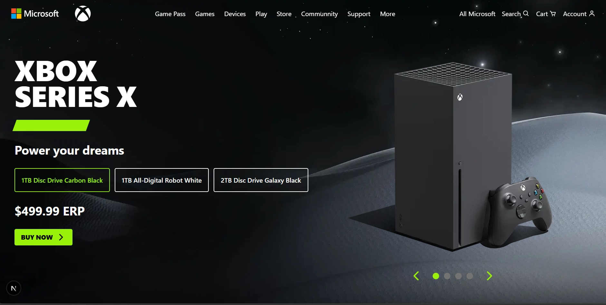

# ✨ Xbox Series X | Next-Gen Gaming Experience! ✨

> **Experience the power of next-generation gaming with Xbox Series X.** 🎮 Explore stunning visuals, immersive 3D experiences, and smooth animations in this interactive showcase of Microsoft's flagship console.


---

## 🌟 Features

✅ Immersive 3D console visualization  
✅ Next-gen gaming showcase  
✅ Smooth animations with GSAP and Lenis  
✅ Responsive design for all devices  
✅ Interactive UI elements  
✅ High-performance rendering with Three.js

---

## 🛠️ Tech Stack

- **Framework:** 🚀 Next.js 15.3.1
- **3D Rendering:** 🎨 Three.js, React Three Fiber, Drei
- **Animations:** 🎥 GSAP, Lenis for smooth scrolling
- **Styling:** 🎨 Tailwind CSS 4.1.7
- **Type Safety:** 📝 TypeScript 5.8.3
- **Icons:** 🔍 React Icons
- **Performance:** 🚄 Hardware-accelerated rendering with GPU detection

---

## 📸 Screenshots

Take a look at the stunning visuals of the Xbox Series X showcase!



---

## ⚡ Installation

Clone the repository:

```sh
git clone https://github.com/dola5xd/xbox-series-x.git
cd xbox-series-x
npm install
```

---

## 🚀 Development

Start the development server with Turbopack:

```sh
npm run dev
```

Build for production:

```sh
npm run build
```

Start the production server:

```sh
npm run start
```

Lint your code:

```sh
npm run lint
```

---

## 🤝 Contributing

🚀 Pull requests are welcome! For major changes, please open an issue first to discuss what you would like to change.

---

## 📄 License

📜 This project is licensed under the **MIT License**.

---

## 🧠 Project Structure

```
xbox-series-x/
├── app/                # Next.js app directory
│   ├── page.tsx        # Main page component
│   ├── layout.tsx      # Root layout component
│   ├── _components/        # React components
│   ├── 3DComponents/   # 3D-related components
│   ├── sections/       # Page section components
│   │   ├── Button.tsx
│   │   ├── Counter.tsx
│   │   ├── Header.tsx
│   │   └── Slider.tsx
│   ├── ControllerModel.tsx  # Xbox controller 3D model
│   ├── OldGames.tsx    # Retro games component
│   ├── _context/           # React context providers
│   ├── _hooks/             # Custom React hooks
│   ├── _lib/               # Utility functions
│   ├── _assets/            # Project assets
│   └── globals.css         # Global CSS styles
├── public/             # Static assets
│

```

---

## 🔮 Key Features Explained

### 3D Console Visualization

Experience the Xbox Series X in stunning 3D with interactive controls to rotate, zoom, and explore the console from every angle.

### Performance Optimization

Using detect-gpu for hardware capability detection to deliver the optimal experience based on the user's device.

### Smooth Animations

Combination of GSAP for element animations and Lenis for butter-smooth scrolling creates an immersive, high-quality user experience.

---

💖 Made with passion by **dola5xd**
